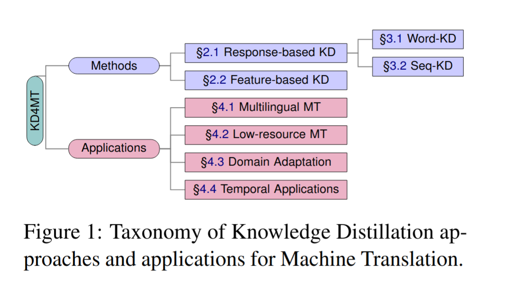

# KD4MT: A Survey of Knowledge Distillation for Machine Translation

This is the list of the papers surveyed in the manuscript " KD4MT: A Survey of Knowledge Distillation for Machine Translation."

In this repository, we provide the full list of surveyed papers as well as the database that we have compiled for our analysis. You can find the raw data [here](data/database.tsv).

## Abstract

Large-scale Machine Translation (MT) systems pose a challenge in terms of their environmental impact and accessibility. 
One method to produce more efficient machine translation models is Knowledge Distillation (KD). 
This survey comprehensively explores the application of KD in the domain of MT. 
We propose a double taxonomy that classifies the surveyed articles in regards to their method used and their application. 

## Paper List

### Methods

1. Yoon Kim and Alexander M. Rush. Sequence-level knowledge distillation. In *Proceedings of the 2016 Conference on Empirical Methods in Natural Language Processing*, pages 1317–1327, Austin, Texas, November 2016. Association for Computational Linguistics.

2. Fusheng Wang, Jianhao Yan, Fandong Meng, and Jie Zhou. Selective knowledge distillation for neural machine translation. In *Proceedings of the 59th Annual Meeting of the Association for Computational Linguistics and the 11th International Joint Conference on Natural Language Processing (Volume 1: Long Papers)*, pages 6456–6466, Online, August 2021. Association for Computational Linguistics.

3. Songming Zhang, Yunlong Liang, Shuaibo Wang, Yufeng Chen, Wenjuan Han, Jian Liu, and Jinan Xu. Towards understanding and improving knowledge distillation for neural machine translation. In Anna Rogers, Jordan Boyd-Graber, and Naoaki Okazaki, editors, *Proceedings of the 61st Annual Meeting of the Association for Computational Linguistics (Volume 1: Long Papers)*, pages 8062–8079, Toronto, Canada, July 2023. Association for Computational Linguistics.

4. Zhongjian Miao, Wen Zhang, Jinsong Su, Xiang Li, Jian Luan, Yidong Chen, Bin Wang, and Min Zhang. Exploring all-in-one knowledge distillation framework for neural machine translation. In Houda Bouamor, Juan Pino, and Kalika Bali, editors, *Proceedings of the 2023 Conference on Empirical Methods in Natural Language Processing*, pages 2929–2940, Singapore, December 2023. Association for Computational Linguistics.

5. Markus Freitag, Yaser Al-Onaizan, and Baskaran Sankaran. Ensemble distillation for neural machine translation. *ArXiv*, abs/1702.01802, 2017.

6. Dakun Zhang, Josep Crego, and Jean Senellart. Analyzing knowledge distillation in neural machine translation. In *Proceedings of the 15th International Conference on Spoken Language Translation*, pages 23–30, Brussels, October 29-30, 2018. International Conference on Spoken Language Translation.

7. Xiaobo Liang, Lijun Wu, Juntao Li, Tao Qin, Min Zhang, and Tie-Yan Liu. Multi-teacher distillation with single model for neural machine translation. *IEEE/ACM Transactions on Audio, Speech, and Language Processing*, 30:992–1002, 2022.

8. Alexander Lin, Jeremy Wohlwend, Howard Chen, and Tao Lei. Autoregressive knowledge distillation through imitation learning. In *Proceedings of the 2020 Conference on Empirical Methods in Natural Language Processing (EMNLP)*, pages 6121–6133, Online, November 2020. Association for Computational Linguistics.

9. Hendra Setiawan. Accurate knowledge distillation via n-best reranking. In Kevin Duh, Helena Gomez, and Steven Bethard, editors, *Proceedings of the 2024 Conference of the North American Chapter of the Association for Computational Linguistics: Human Language Technologies (Volume 1: Long Papers)*, pages 1330–1345, Mexico City, Mexico, June 2024. Association for Computational Linguistics.

10. Yuqiao Wen, Zichao Li, Wenyu Du, and Lili Mou. f-divergence minimization for sequence-level knowledge distillation. In Anna Rogers, Jordan Boyd-Graber, and Naoaki Okazaki, editors, *Proceedings of the 61st Annual Meeting of the Association for Computational Linguistics (Volume 1: Long Papers)*, pages 10817–10834, Toronto, Canada, July 2023. Association for Computational Linguistics.

### Applications

#### Multilingual MT

11. Xu Tan, Yi Ren, Di He, Tao Qin, Zhou Zhao, and Tie-Yan Liu. Multilingual neural machine translation with knowledge distillation. *arXiv preprint arXiv:1902.10461*, 2019.

12. Heejin Do and Gary Geunbae Lee. Target-oriented knowledge distillation with language-family-based grouping for multilingual NMT. *ACM Trans. Asian Low-Resour. Lang. Inf. Process.*, 22(2), March 2023.

13. Alireza Mohammadshahi, Vassilina Nikoulina, Alexandre Bérard, Caroline Brun, James Henderson, and Laurent Besacier. Small-100: Introducing shallow multilingual machine translation model for low-resource languages. In *Proceedings of the 2022 Conference on Empirical Methods in Natural Language Processing*, pages 8348–8359, 2022.

14. Ankur Bapna, Isaac Caswell, Julia Kreutzer, Orhan Firat, Daan van Esch, Aditya Siddhant, Mengmeng Niu, Pallavi Baljekar, Xavier Garcia, Wolfgang Macherey, et al. Building machine translation systems for the next thousand languages. *arXiv preprint arXiv:2205.03983*, 2022.

15. Marta R Costa-jussà, James Cross, Onur Çelebi, Maha Elbayad, Kenneth Heafield, Kevin Heffernan, Elahe Kalbassi, Janice Lam, Daniel Licht, Jean Maillard, et al. No language left behind: Scaling human-centered machine translation. *arXiv preprint arXiv:2207.04672*, 2022.

16. Jay Gala, Pranjal A Chitale, AK Raghavan, Varun Gumma, Sumanth Doddapaneni, Janki Atul Nawale, Anupama Sujatha, Ratish Puduppully, Vivek Raghavan, Pratyush Kumar, et al. Indictrans2: Towards high-quality and accessible machine translation models for all 22 scheduled Indian languages. *Transactions on Machine Learning Research*, 2023.

#### Low-resource MT

17. Xinlu Zhang, Xiao Li, Yating Yang, and Rui Dong. Improving low-resource neural machine translation with teacher-free knowledge distillation. *IEEE Access*, 8:206638–206645, 2020.

18. Christos Baziotis, Ivan Titov, Alexandra Birch, and Barry Haddow. Exploring unsupervised pretraining objectives for machine translation. In *Findings of the Association for Computational Linguistics: ACL-IJCNLP 2021*, pages 2956–2971, Online, August 2021. Association for Computational Linguistics.

19. Guanghua Zhang, Hua Liu, Junjun Guo, and Tianyu Guo. Distilling BERT knowledge into seq2seq with regularized mixup for low-resource neural machine translation. *Expert Systems with Applications*, page 125314, 2024.

20. Yun Chen, Yang Liu, Yong Cheng, and Victor OK Li. A teacher-student framework for zero-resource neural machine translation. In *Proceedings of the 55th Annual Meeting of the Association for Computational Linguistics (Volume 1: Long Papers)*, pages 1925–1935, 2017.

21. Tianyu He, Jiale Chen, Xu Tan, and Tao Qin. Language graph distillation for low-resource machine translation. *arXiv e-prints*, arXiv-1908, 2019.

22. Jian Yang, Yuwei Yin, Shuming Ma, Dongdong Zhang, Shuangzhi Wu, Hongcheng Guo, Zhoujun Li, and Furu Wei. UM4: Unified multilingual multiple teacher-student model for zero-resource neural machine translation. In *Proceedings of the Thirty-First International Joint Conference on Artificial Intelligence, IJCAI-2022*. International Joint Conferences on Artificial Intelligence Organization, July 2022.

23. Khalid Ahmed and Jan Buys. Neural machine translation between low-resource languages with synthetic pivoting. In *Proceedings of the 2024 Joint International Conference on Computational Linguistics, Language Resources and Evaluation (LREC-COLING 2024)*, pages 12144–12158, 2024.

24. Fahimeh Saleh, Wray Buntine, and Gholamreza Haffari. Collective wisdom: Improving low-resource neural machine translation using adaptive knowledge distillation. In Donia Scott, Nuria Bel, and Chengqing Zong, editors, *Proceedings of the 28th International Conference on Computational Linguistics*, pages 3413–3421, Barcelona, Spain (Online), December 2020. International Committee on Computational Linguistics.

25. Fahimeh Saleh, Wray Buntine, Gholamreza Haffari, and Lan Du. Multilingual neural machine translation: Can linguistic hierarchies help? In *Findings of the Association for Computational Linguistics: EMNLP 2021*, pages 1313–1330, Punta Cana, Dominican Republic, November 2021. Association for Computational Linguistics.

26. Yichong Huang, Xiaocheng Feng, Xinwei Geng, and Bing Qin. Unifying the convergences in multilingual neural machine translation. In Yoav Goldberg, Zornitsa Kozareva, and Yue Zhang, editors, *Proceedings of the 2022 Conference on Empirical Methods in Natural Language Processing*, pages 6822–6835, Abu Dhabi, United Arab Emirates, December 2022. Association for Computational Linguistics.

27. Xiaocheng Feng, Xinwei Geng, Baohang Li, Bing Qin, et al. Towards higher Pareto frontier in multilingual machine translation. In *The 61st Annual Meeting Of The Association For Computational Linguistics*, 2023.

28. Aniruddha Roy, Pretam Ray, Ayush Maheshwari, Sudeshna Sarkar, and Pawan Goyal. Enhancing low-resource NMT with a multilingual encoder and knowledge distillation: A case study. In Atul Kr. Ojha, Chao-hong Liu, Ekaterina Vylomova, Flammie Pirinen, Jade Abbott, Jonathan Washington, Nathaniel Oco, Valentin Malykh, Varvara Logacheva, and Xiaobing Zhao, editors, *Proceedings of The Seventh Workshop on Technologies for Machine Translation of Low-Resource Languages (LoResMT 2024)*, pages 64–73, Bangkok, Thailand, August 2024. Association for Computational Linguistics.

29. Aarón Galiano-Jiménez, Felipe Sánchez-Martínez, Víctor M. Sánchez-Cartagena, and Juan Antonio Pérez-Ortiz. Exploiting large pre-trained models for low-resource neural machine translation. In *Proceedings of the 24th Annual Conference of the European Association for Machine Translation*, pages 59–68, 2023.

30. Ona De Gibert, Raúl Vázquez, Mikko Aulamo, Yves Scherrer, Sami Virpioja, and Jörg Tiedemann. Four approaches to low-resource multilingual NMT: The Helsinki submission to the AmericasNLP 2023 shared task. In Manuel Mager, Abteen Ebrahimi, Arturo Oncevay, Enora Rice, Shruti Rijhwani, Alexis Palmer, and Katharina Kann, editors, *Proceedings of the Workshop on Natural Language Processing for Indigenous Languages of the Americas (AmericasNLP)*, pages 177–191, Toronto, Canada, July 2023. Association for Computational Linguistics.

31. Yewei Song, Saad Ezzini, Jacques Klein, Tegawende Bissyande, Clément Lefebvre, and Anne Goujon. Letz translate: Low-resource machine translation for Luxembourgish. In *2023 5th International Conference on Natural Language Processing (ICNLP)*, pages 165–170. IEEE, 2023.

32. Maxim Enis and Mark Hopkins. From LLM to NMT: Advancing low-resource machine translation with Claude. *arXiv preprint arXiv:2404.13813*, 2024.

33. Raj Dabre and Atsushi Fujita. Combining sequence distillation and transfer learning for efficient low-resource neural machine translation models. In *Proceedings of the Fifth Conference on Machine Translation*, pages 492–502, Online, November 2020. Association for Computational Linguistics.

34. Harshita Diddee, Sandipan Dandapat, Monojit Choudhury, Tanuja Ganu, and Kalika Bali. Too brittle to touch: Comparing the stability of quantization and distillation towards developing low-resource MT models. In Philipp Koehn, Loïc Barrault, Ondřej Bojar, Fethi Bougares, Rajen Chatterjee, Marta R. Costa-jussà, Christian Federmann, Mark Fishel, Alexander Fraser, Markus Freitag, Yvette Graham, Roman Grundkiewicz, Paco Guzman, Barry Haddow, Matthias Huck, Antonio Jimeno Yepes, Tom Kocmi, André Martins, Makoto Morishita, Christof Monz, Masaaki Nagata, Toshiaki Nakazawa, Matteo Negri, Aurélie Névéol, Mariana Neves, Martin Popel, Marco Turchi, and Marcos Zampieri, editors, *Proceedings of the Seventh Conference on Machine Translation (WMT)*, pages 870–885, Abu Dhabi, United Arab Emirates (Hybrid), December 2022. Association for Computational Linguistics.

35. Varun Gumma, Raj Dabre, and Pratyush Kumar. An empirical study of leveraging knowledge distillation for compressing multilingual neural machine translation models. In *Proceedings of the 24th Annual Conference of the European Association for Machine Translation*, pages 103–114, 2023.

#### Domain Adaptation

36. Jiali Zeng, Yang Liu, Jinsong Su, Yubing Ge, Yaojie Lu, Yongjing Yin, and Jiebo Luo. Iterative dual domain adaptation for neural machine translation. In *Proceedings of the 2019 Conference on Empirical Methods in Natural Language Processing and the 9th International Joint Conference on Natural Language Processing (EMNLP-IJCNLP)*, pages 845–855, Hong Kong, China, November 2019. Association for Computational Linguistics.

37. Idriss Mghabbar and Pirashanth Ratnamogan. Building a multi-domain neural machine translation model using knowledge distillation. *arXiv preprint arXiv:2004.07324*, 2020.

38. Yupeng Liu, Lei Zhang, and Yanan Zhang. Neural machine translation transfer model based on mutual domain guidance. *IEEE Access*, 10:101595–101608, 2022.

39. Shuhao Gu, Yang Feng, and Wanying Xie. Pruning-then-expanding model for domain adaptation of neural machine translation. In *Proceedings of the 2021 Conference of the North American Chapter of the Association for Computational Linguistics: Human Language Technologies*, pages 3942–3952, Online, June 2021. Association for Computational Linguistics.

40. Mitchell Gordon and Kevin Duh. Distill, adapt, distill: Training small, in-domain models for neural machine translation. In *Proceedings of the Fourth Workshop on Neural Generation and Translation*, pages 110–118, Online, July 2020. Association for Computational Linguistics.

41. Anna Currey, Prashant Mathur, and Georgiana Dinu. Distilling multiple domains for neural machine translation. In *Proceedings of the 2020 Conference on Empirical Methods in Natural Language Processing (EMNLP)*, pages 4500–4511, Online, November 2020. Association for Computational Linguistics.

42. Hao-Ran Wei, Shujian Huang, Ran Wang, Xin-yu Dai, and Jiajun Chen. Online distilling from checkpoints for neural machine translation. In *Proceedings of the 2019 Conference of the North American Chapter of the Association for Computational Linguistics: Human Language Technologies, Volume 1 (Long and Short Papers)*, pages 1932–1941, Minneapolis, Minnesota, June 2019. Association for Computational Linguistics.

43. Yang Zhao, Junnan Zhu, Lu Xiang, Jiajun Zhang, Yu Zhou, Feifei Zhai, and Chengqing Zong. Life-long learning for multilingual neural machine translation with knowledge distillation. *arXiv preprint arXiv:2212.02800*, 2022.

44. Yuanchi Zhang, Peng Li, Maosong Sun, and Yang Liu. Continual knowledge distillation for neural machine translation. In Anna Rogers, Jordan Boyd-Graber, and Naoaki Okazaki, editors, *Proceedings of the 61st Annual Meeting of the Association for Computational Linguistics (Volume 1: Long Papers)*, pages 7978–7996, Toronto, Canada, July 2023. Association for Computational Linguistics.

#### Temporal Applications

45. Shushu Wang, Jing Wu, Kai Fan, Wei Luo, Jun Xiao, and Zhongqiang Huang. Better simultaneous translation with monotonic knowledge distillation. In Anna Rogers, Jordan Boyd-Graber, and Naoaki Okazaki, editors, *Proceedings of the 61st Annual Meeting of the Association for Computational Linguistics (Volume 1: Long Papers)*, pages 2334–2349, Toronto, Canada, July 2023. Association for Computational Linguistics.

46. Hexuan Deng, Liang Ding, Xuebo Liu, Meishan Zhang, Dacheng Tao, and Min Zhang. Improving simultaneous machine translation with monolingual data. In *Proceedings of the Thirty-Seventh AAAI Conference on Artificial Intelligence and Thirty-Fifth Conference on Innovative Applications of Artificial Intelligence and Thirteenth Symposium on Educational Advances in Artificial Intelligence*, pages 12728–12736, 2023.

47. Sukanta Sen, Rico Sennrich, Biao Zhang, and Barry Haddow. Self-training reduces flicker in retranslation-based simultaneous translation. In Andreas Vlachos and Isabelle Augenstein, editors, *Proceedings of the 17th Conference of the European Chapter of the Association for Computational Linguistics*, pages 3734–3744, Dubrovnik, Croatia, May 2023. Association for Computational Linguistics.

48. Biao Zhang, Deyi Xiong, Jinsong Su, and Jiebo Luo. Future-aware knowledge distillation for neural machine translation. *IEEE/ACM Transactions on Audio, Speech, and Language Processing*, 27(12):2278–2287, 2019.

49. Yang Feng, Shuhao Gu, Dengji Guo, Zhengxin Yang, and Chenze Shao. Guiding teacher forcing with seer forcing for neural machine translation. In *Proceedings of the 59th Annual Meeting of the Association for Computational Linguistics and the 11th International Joint Conference on Natural Language Processing (Volume 1: Long Papers)*, pages 2862–2872, Online, August 2021. Association for Computational Linguistics.

50. Chulun Zhou, Fandong Meng, Jie Zhou, Min Zhang, Hongji Wang, and Jinsong Su. Confidence based bidirectional global context aware training framework for neural machine translation. In *Proceedings of the 60th Annual Meeting of the Association for Computational Linguistics (Volume 1: Long Papers)*, pages 2878–2889, Dublin, Ireland, May 2022. Association for Computational Linguistics.

51. Yimeng Zhuang and Mei Tu. Pretrained bidirectional distillation for machine translation. In Anna Rogers, Jordan Boyd-Graber, and Naoaki Okazaki, editors, *Proceedings of the 61st Annual Meeting of the Association for Computational Linguistics (Volume 1: Long Papers)*, pages 1132–1145, Toronto, Canada, July 2023. Association for Computational Linguistics.

52. Chenze Shao, Xuanfu Wu, and Yang Feng. One reference is not enough: Diverse distillation with reference selection for non-autoregressive translation. In *Proceedings of the 2022 Conference of the North American Chapter of the Association for Computational Linguistics: Human Language Technologies*, pages 3779–3791, 2022.

53. Jiaxin Guo, Minghan Wang, Daimeng Wei, Hengchao Shang, Yuxia Wang, Zongyao Li, Zhengzhe Yu, Zhanglin Wu, Yimeng Chen, Chang Su, et al. Self-distillation mixup training for non-autoregressive neural machine translation. *arXiv preprint arXiv:2112.11640*, 2021.

54. Min Liu, Yu Bao, Chengqi Zhao, and Shujian Huang. Selective knowledge distillation for non-autoregressive neural machine translation. In *Proceedings of the AAAI Conference on Artificial Intelligence*, volume 37, pages 13246–13254, 2023.

55. Jiawei Zhou and Phillip Keung. Improving non-autoregressive neural machine translation with monolingual data. In *Proceedings of the 58th Annual Meeting of the Association for Computational Linguistics*, pages 1893–1898, 2020.

56. Chunting Zhou, Jiatao Gu, and Graham Neubig. Understanding knowledge distillation in non-autoregressive machine translation. In *International Conference on Learning Representations*, 2020.

57. Mitchell A. Gordon and Kevin Duh. Explaining sequence-level knowledge distillation as data-augmentation for neural machine translation. *arXiv preprint arXiv:1912.03334*, 2019.

58. Yi Ren, Jinglin Liu, Xu Tan, Zhou Zhao, Sheng Zhao, and Tie-Yan Liu. A study of non-autoregressive model for sequence generation. In *Proceedings of the 58th Annual Meeting of the Association for Computational Linguistics*, pages 149–159, Online, July 2020. Association for Computational Linguistics.

59. Liang Ding, Longyue Wang, Xuebo Liu, Derek F. Wong, Dacheng Tao, and Zhaopeng Tu. Rejuvenating low-frequency words: Making the most of parallel data in non-autoregressive translation. In *Proceedings of the 59th Annual Meeting of the Association for Computational Linguistics and the 11th International Joint Conference on Natural Language Processing (Volume 1: Long Papers)*, pages 3431–3441, 2021.

60. Liang Ding, Longyue Wang, Xuebo Liu, Derek F. Wong, Dacheng Tao, and Zhaopeng Tu. Understanding and improving lexical choice in non-autoregressive translation. In *International Conference on Learning Representations*, 2021.

61. Weijia Xu, Shuming Ma, Dongdong Zhang, and Marine Carpuat. How does distilled data complexity impact the quality and confidence of non-autoregressive machine translation? In *Findings of the Association for Computational Linguistics: ACL-IJCNLP 2021*, pages 4392–4400, 2021.
